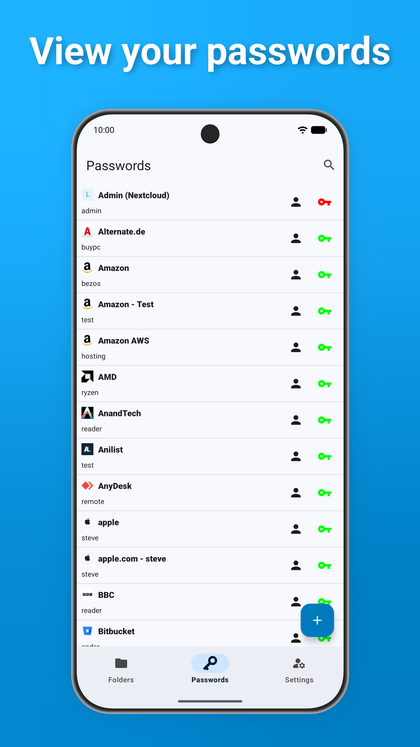
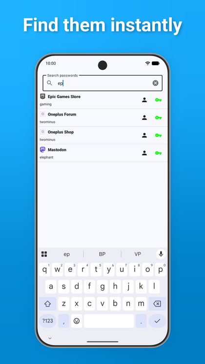
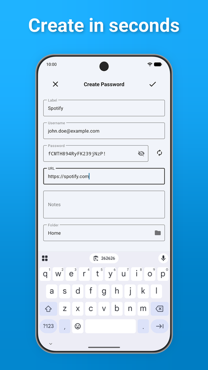
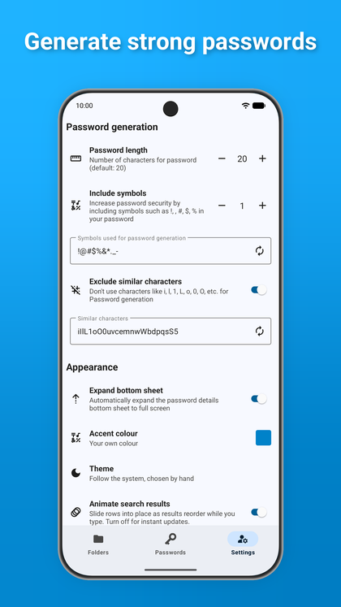
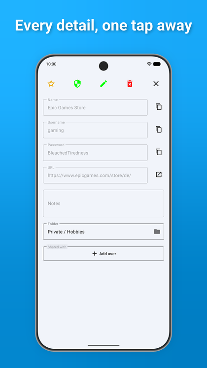
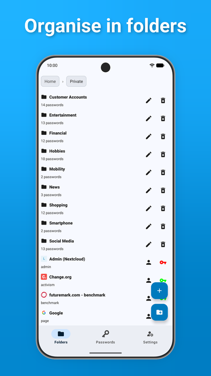
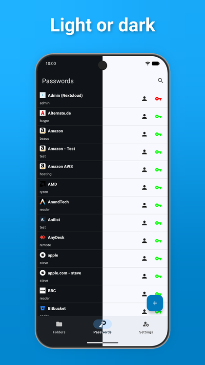

# Nextcloud Passwords for Android

An open-source Android client for the [Nextcloud Passwords](https://apps.nextcloud.com/apps/passwords) application.

<a href='https://play.google.com/store/apps/details?id=com.dominikdomotor.nextcloudpasswords' target="_blank" rel="noopener noreferrer">
  
</a>


---


## About the Project

This project aims to be a fully-featured, secure, and user-friendly password manager for Android that syncs with your self-hosted Nextcloud instance. It leverages the Android Autofill framework for seamless integration with other apps and browsers.

#### Current Status: **1.0.0-beta01**
Functional for daily use and in beta while the 1.0 line settles. Feedback and contributions are always
welcome — see [CHANGELOG.md](CHANGELOG.md) for what has changed.

---

## Screenshots

<p float="left">
  
  
  
  
  
  
  
</p>

---

## Features

### Current Features
- **Secure login & sync:** Nextcloud Login Flow v2, with a foreground service that survives the
  browser handover and returns you to the app automatically.
- **Full password management:** create, view, edit, delete, and mark favourites.
- **Folders:** browse a folder tree with breadcrumbs, and create, rename, move and delete folders.
- **End-to-end encryption:** full `CSEv1r1` support — the `PWDv1r1` challenge, keychain decryption,
  and per-field encryption on write. The passphrase stays in memory unless you opt into storing it.
- **Sharing:** share with server-backed recipient search, adjust permissions, and revoke shares.
- **Android Autofill:** hint- and heuristic-based field detection, inline (keyboard) suggestions,
  a searchable picker, a manual fallback for unrecognised fields, and a per-app blocklist.
- **Offline caching:** passwords and favicons are stored AES-256-GCM encrypted with a key held in
  the Android Keystore, and are readable without a connection.
- **Password generation:** configurable length, symbol set and symbol count, with an option to
  exclude look-alike characters.
- **Theming:** the whole interface is a Material 3 palette generated from one seed colour — the colour
  your Nextcloud admin set in the Theming app, one you pick, or your wallpaper. Light, dark and an
  AMOLED mode with true-black surfaces. Status colours stay literal so they still read as signals.
- **Privacy:** the window opens with `FLAG_SECURE` set and only relaxes it if you allow screenshots,
  and copied secrets are marked sensitive and cleared from the clipboard after 30 seconds.
- **No backup by default:** the offline store is encrypted with a key that never leaves the device, so
  it is excluded from cloud backup and device-to-device transfer rather than restored unreadable.
- **Self-signed certificates:** pin and trust a certificate after showing you its SHA-256
  fingerprint and expiry.

### Roadmap (Planned Features)
- App lock with biometrics or a PIN code.
- View and edit custom fields.
- Tags.
- Share expiry dates.
- Trash / restore deleted passwords.
- In-app language selection.
- Passwords API token and 2FA support (only the `PWDv1r1` challenge is implemented today).

---

## Architecture

- **Kotlin, views (no Compose), Material 3**, `minSdk 29` / `targetSdk 36`, Java 17.
- **Hilt** for dependency injection throughout.
- **`PasswordRepository`** is the single entry point for password data. It sequences "call the
  server, then update the local store" and returns a typed `ApiResult` for every operation, so
  failures carry a reason instead of being indistinguishable from an empty result.
- **`StorageManager`** owns the encrypted local document and publishes immutable `StateFlow`
  snapshots. Callers never receive the backing collections.
- **ViewModels** (`PasswordsViewModel`, `FoldersViewModel`, `SettingsViewModel`,
  `PasswordActionsViewModel`, `OverviewViewModel`) hold all screen state; fragments only render and
  forward events.
- **`PasswordsApiClient`** issues every API call in one place, so connection handling, session-token
  capture and status-code mapping are not repeated per endpoint.
- **`ui/theme/`** generates the Material 3 palette from a seed colour and delivers it by overriding the
  app's own colour resources at runtime, so the theme itself stays static and every `?attr/` reference
  follows the seed. `PaletteGenerator` is a pure function of the seed and is unit-tested as one,
  including its contrast guarantees.

## Documentation

- [CHANGELOG.md](CHANGELOG.md) — what changed, per release.
- [docs/DESIGN_NOTES.md](docs/DESIGN_NOTES.md) — decisions and traps that are expensive to rediscover:
  why the theme is static while the resource values move, why the dialog style has to be a
  `ThemeOverlay`, which colours must stay literal because they are inflated in another app's process.

---

## Building from Source

To build and run this project yourself, follow these simple steps:

1.  **Clone the repository:**
    ```bash
    git clone https://github.com/XXDoMi77/nextcloud_passwords_android_client.git
    ```
2.  **Open in Android Studio:**
    Open the cloned project directory in the latest stable version of Android Studio.
3.  **Sync Gradle:**
    Allow Android Studio to automatically download and sync the required Gradle dependencies.
4.  **Build & Run:**
    Build and run the app on an emulator or a physical Android device.

### Checks

```bash
./gradlew :app:ktfmtCheck        # formatting (ktfmt, kotlinlang style, 120 columns)
./gradlew :app:testDebugUnitTest # unit tests
./gradlew :app:lintDebug         # Android lint
```

`lintDebug` is stricter than it looks: `MissingTranslation` is fatal, so every user-visible string
needs its German twin in `values-de/strings.xml` before a release build will pass.

Formatting is enforced by the build, not only by the IDE. Run `./gradlew :app:ktfmtFormat` to fix.

### Release builds

Release signing material is deliberately kept outside this repository, so a signed build cannot be
produced from a clean clone. The build script reads the keystore path from the
`NPAC_KEYSTORE_PROPERTIES` environment variable (or the `releaseKeystoreProperties` Gradle property)
and falls back to an unsigned release build when neither is set.

---

## Versioning

`versionName` is semantic, with a pre-release tag while a line is still settling —
`1.0.0-beta01`, then `1.0.0` once it is stable.

`versionCode` is a plain counter. Play only requires that it be larger than the last upload, and
deriving it from the version number invites a collision the first time a beta and a patch release
want the same slot. Bump it on **every** upload, including a re-upload of the same `versionName`.

A `versionName` carrying a pre-release tag belongs on a testing track, not production; the release
script prints a warning to that effect and records it in `BUILD_INFO.txt`.

---

## Disclaimer

This application is provided "as is" and without warranty of any kind. The author is not liable for any damages resulting from the use of this software. Please use it at your own risk.
